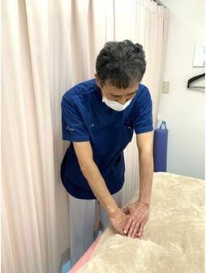

[index.html](https://github.com/user-attachments/files/28282797/index.html)
<!DOCTYPE html>
<html lang="ja">
<head>
  <meta charset="UTF-8">
  <meta name="viewport" content="width=device-width, initial-scale=1">
  <title>札幌の腰痛特化ケア｜施術者 川口 隆</title>

  <meta name="description" content="札幌市中央区で腰痛に特化した施術を行う川口隆の紹介ページ。慢性的な腰の痛み、立ち仕事やデスクワークによる腰の重だるさに、丁寧なケアで寄り添います。大通駅1番出口から徒歩1分。">
  <meta name="robots" content="index,follow">
  <meta name="format-detection" content="telephone=no">
  <link rel="canonical" href="https://example.com/">

  <meta property="og:type" content="website">
  <meta property="og:locale" content="ja_JP">
  <meta property="og:site_name" content="腰痛特化ケア｜川口 隆">
  <meta property="og:title" content="札幌の腰痛特化ケア｜施術者 川口 隆">
  <meta property="og:description" content="札幌市中央区で腰痛に特化した施術を行う川口隆。つらい腰の痛みや重だるさに、丁寧なケアで向き合います。">
  <meta property="og:image" content="https://example.com/prkw.JPG">
  <meta property="og:url" content="https://example.com/">
  <meta name="twitter:card" content="summary_large_image">

  

  
</head>

<body>
  <header>
    

      <nav aria-label="メインナビゲーション">
        
腰痛特化ケア｜川口 隆

        

          <a href="#symptoms">腰痛のお悩み</a>
          <a href="#about">紹介</a>
          <a href="#course">料金</a>
          <a href="#contact">予約</a>
          <a href="#access">アクセス</a>
        

      </nav>
    

  </header>

  <main>
    <section class="hero">
      

        

          
札幌市中央区・大通駅徒歩1分

          <h1>つらい腰痛に、やさしく深く届く専門ケア。</h1>
          

            札幌で腰痛に特化した施術を行う、施術者 <strong>川口 隆</strong> の紹介ページです。
          

          

            慢性的な腰の痛み、立ち仕事やデスクワークによる腰の重だるさ、朝起きた時のこわばりなど、
            一人ひとりの状態に合わせて丁寧にケアします。
          

          

            <a class="btn" href="https://beauty.hotpepper.jp/CSP/kr/reserve/?storeId=H000702622&amp;staffId=W001050972" target="_blank" rel="noopener">ネット予約する</a>
            <a class="btn secondary" href="tel:0112310313">電話する</a>
          

        

        

          
        

      

    </section>

    <section id="symptoms">
      

        <h2 class="section-title">このような腰のお悩みはありませんか？</h2>
        
腰痛は、腰だけでなく背中・骨盤・脚の負担とも関係します。

        

          <article class="card">
            <h3>慢性的な腰の痛み</h3>
            
長年続く腰の重だるさや、同じ姿勢が続くとつらくなる腰痛に。

          </article>

          <article class="card">
            <h3>立ち仕事・座り仕事の腰痛</h3>
            
仕事中や仕事終わりに腰が重い、張る、固まる感じがある方へ。

          </article>

          <article class="card">
            <h3>朝起きた時のこわばり</h3>
            
起床時に腰が伸びにくい、動き出しがつらい方のケアに。

          </article>
        

      

    </section>

    <section id="about">
      

        <h2 class="section-title">施術者紹介</h2>
        
腰痛に向き合い、丁寧に整えていく施術です。

        <article class="card profile-card">
          <h3>川口 隆</h3>
          

            腰痛でお悩みの方に対して、腰だけでなく背中・骨盤まわり・脚の緊張まで確認しながら、
            身体全体のバランスを見て施術します。
          

          

            強さを確認しながら、無理のない施術を心がけています。
            初めての方でも安心して受けていただけるよう、丁寧な対応を大切にしています。
          

        </article>
      

    </section>

    <section id="course">
      

        <h2 class="section-title">料金</h2>
        
腰痛の状態やお身体の疲れに合わせてお選びください。

        

          <article class="card">
            <h3>60分コース</h3>
            
5,500円

            
腰痛が気になる方、まずは試してみたい方におすすめです。

          </article>

          <article class="card">
            <h3>90分コース</h3>
            
8,250円

            
腰だけでなく、背中や脚までしっかり整えたい方に。

          </article>

          <article class="card">
            <h3>120分コース</h3>
            
11,000円

            
慢性的な腰痛や全身の疲労感が強い方におすすめです。

          </article>
        

      

    </section>

    <section id="contact">
      

        <h2 class="section-title">ご予約・お問い合わせ</h2>
        
ご予約時に「川口のHPみた」とお伝えください。

        

          
お電話でのご予約

          
<a href="tel:0112310313">011-231-0313</a>

          
ネット予約はこちら

          <a class="btn" href="https://beauty.hotpepper.jp/CSP/kr/reserve/?storeId=H000702622&amp;staffId=W001050972" target="_blank" rel="noopener">
            ネット予約する
          </a>

          

            予約時に <strong>「川口のHPみた」</strong> とお伝えください。
          

        

      

    </section>

    <section id="access">
      

        <h2 class="section-title">アクセス</h2>
        
札幌市中央区南1条西6丁目 第27桂和ビル6Fへお越しください。

        

          

            <dl class="info-list">
              

                <dt>住所</dt>
                <dd>札幌市中央区南1条西6丁目 第27桂和ビル6F</dd>
              

              

                <dt>電話番号</dt>
                <dd><a href="tel:0112310313">011-231-0313</a></dd>
              

              

                <dt>最寄駅</dt>
                <dd>地下鉄 大通駅1番出口下車 徒歩1分 市電 4丁目・8丁目下車 徒歩3分</dd>
              

            </dl>
          

          

            <iframe
              title="札幌市中央区南1条西6丁目 第27桂和ビル6Fの地図"
              src="https://www.google.com/maps?q=%E6%9C%AD%E5%B9%8C%E5%B8%82%E4%B8%AD%E5%A4%AE%E5%8C%BA%E5%8D%971%E6%9D%A1%E8%A5%BF6%E4%B8%81%E7%9B%AE%20%E7%AC%AC27%E6%A1%82%E5%92%8C%E3%83%93%E3%83%AB6F&amp;output=embed"
              loading="lazy"
              referrerpolicy="no-referrer-when-downgrade"
              allowfullscreen>
            </iframe>
          

        

      

    </section>
  </main>

  <footer>
    

      © 腰痛特化ケア 施術者 川口 隆
    

  </footer>
</body>
</html>
